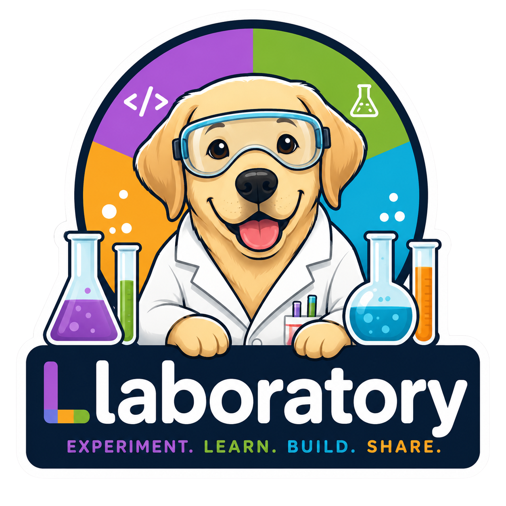

<div align="center">
</img>

<p>

[](https://lbesson.mit-license.org/)   [](https://github.com/ampyard/Llaboratory/actions/workflows/ci.yml)

</p>
</div>


# Llaboratory

A self-hostable, open-source laboratory for studying how LLMs behave when offered a set of fake tools. Design fake tools, wire in any OpenAI-compatible model, run one session or a thousand, and see exactly what the model picked and why.

## Live Session - Demo

<video src="docs/screenshots/live-session.mp4" autoplay loop muted playsinline style="max-width: 100%; border-radius: 8px;" alt="Live Session video"></video>

## Quick Start

### Docker Compose (recommended)

```bash
docker compose up --build
```

Open http://localhost:5173 for the UI. The frontend will proxy API calls to the backend container on port 8000.

### Backend

```bash
cd backend
uv venv
uv pip install -e ".[dev]"
cp ../.env.example ../.env   # fill in your API keys
uv run uvicorn app.main:app --reload
```

### Frontend

```bash
cd frontend
npm install
npm run dev
```

Open http://localhost:5173 — the frontend proxies `/api` to `:8000`.

### First run

A brand-new instance shows a **Getting Started** checklist instead of an empty screen. Click **Load samples** to seed 9 built-in whimsical tools, point a model config at OpenAI/OpenRouter/LM Studio/whatever you have running, build a plan, and hit Run — no manual setup required to see the whole loop work end to end.

## Workflow

1. **Tool Library** → create fake tools with static or dynamic responses, or load the 9 built-in samples
2. **Model Configs** → configure a provider endpoint + model snapshot + API key env var
3. **Plans** → compose tools + model + prompts into a versioned testing plan
4. **Run** → launch a single session and watch the live event stream as reasoning, text, and tool calls arrive — or fire a **batch run** of N repetitions and let them run in the background
5. **Sessions & Batch Runs** → view history, metrics, per-session event timelines, and per-batch progress
6. **Analysis** → review plan-version stats, export CSV, and download a markdown findings report for write-ups or sharing

## Analysis & reporting

Each plan version has a stats view for aggregate outcomes across its sessions, including completed/errored/aborted counts, tool-selection frequency, and per-session breakdowns. From there you can export session metrics as CSV or open the generated findings report to review or download a markdown summary of the run.

## Batch runs

Need more than one data point? Use **Run in batch…** on a plan to launch N repetitions (1–1000) of the same plan version. Batches run sequentially in the background (up to 5 concurrent sessions), can be aborted mid-flight, and show live per-session progress from the **Batch Runs** page — all feeding into the same plan-version stats as a single run.

## Data management

- **Export / Import** — bundle your tools, model configs, and plans (optionally with run history) into a single ZIP, and import it elsewhere with automatic conflict detection and per-item renaming.
- **Factory Reset** — wipe all user-created data and start clean. This cannot be undone; export first if you want to keep a copy.

## Security

Dynamic tool code runs **in-process without sandboxing**. This is intentional for locally-authored tools.
Never execute dynamic code from untrusted sources. See §10.6 of the PRD for the full rationale.

## Running Tests
### Backend
```bash
cd backend
uv run pytest -v --tb=short
```

### Frontend
```bash
cd frontend
npm test
```

## Docs

Full documentation — quickstart, workflow, and architecture — lives at [llaboratory.ampyard.com](https://llaboratory.ampyard.com/) (source in [`docs/`](docs)).

## Contributing

Issues and PRs are welcome. If you build an interesting fake tool or find a surprising model behavior, open an issue — we'd love to hear about it.

[](https://hitcount.dev/p/ampyard/Llaboratory)
